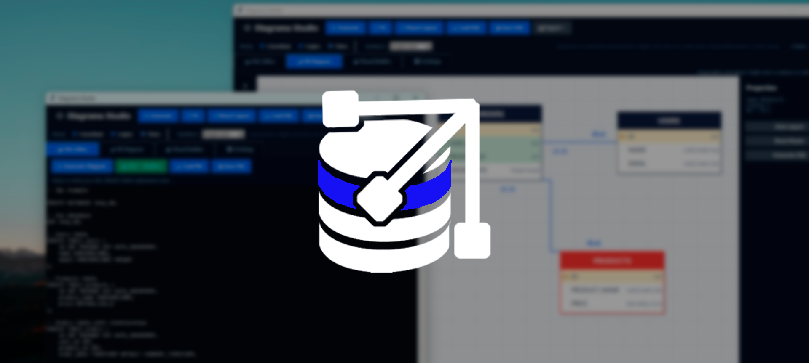
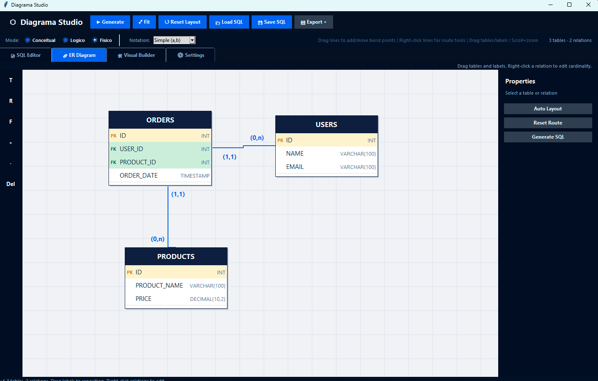

# Diagrama Studio

Ferramenta desenvolvida em Python para conversão entre scripts SQL e modelagem de dados.  
O objetivo do projeto é simplificar a criação, visualização e documentação de estruturas de banco de dados por meio de uma interface prática e intuitiva.

---

## Requirements

- Windows
- 1GB Ram
- 100 MB storage 

---

## Features

- Conversão de SQL para diagramas de banco de dados
- Geração automática de scripts SQL a partir da modelagem
- Suporte a relacionamentos entre tabelas
- Interface intuitiva e focada em produtividade
- Estrutura open source para estudos e contribuições
- Exportação e organização visual da modelagem de dados

---

## Preview

---
## Download

Baixe a versão mais recente do instalador (BETA):

[⬇ Download Diagrama Studio](https://github.com/MathwlL/DiagramMaker/raw/refs/heads/master/releases/DiagramaMakerInstaller.exe)

---

## Contributing

Contribuições, melhorias e sugestões são bem-vindas.  
Sinta-se à vontade para abrir issues ou enviar pull requests.

---

## Disclaimer

Diagrama Studio é um projeto independente e experimental.
